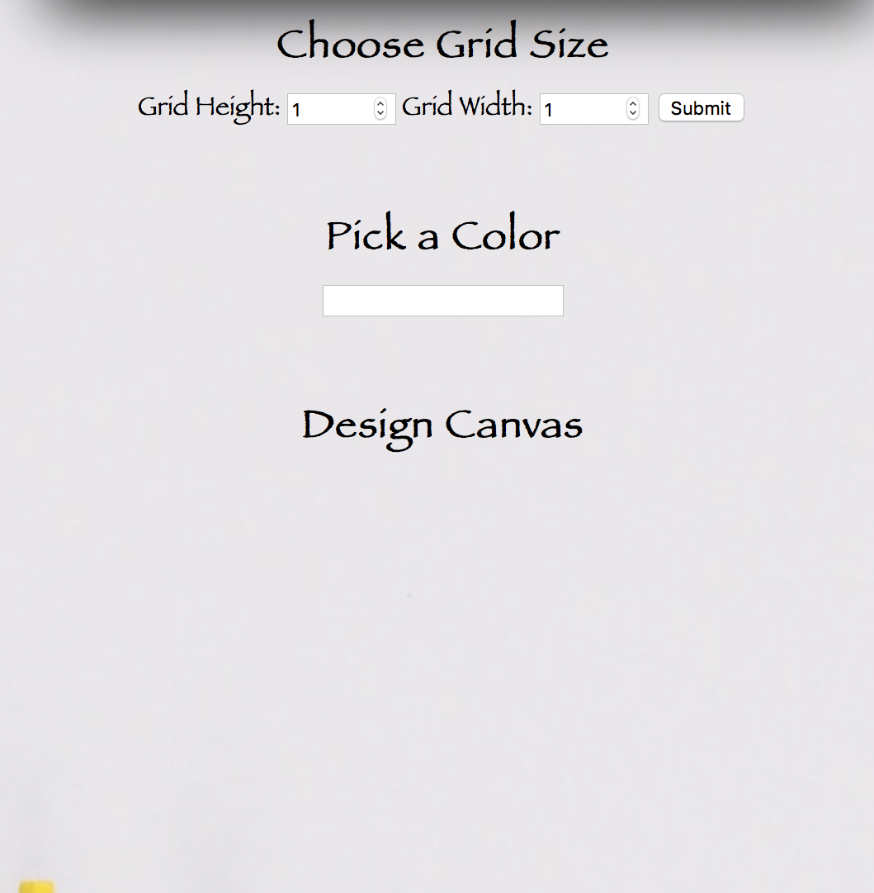
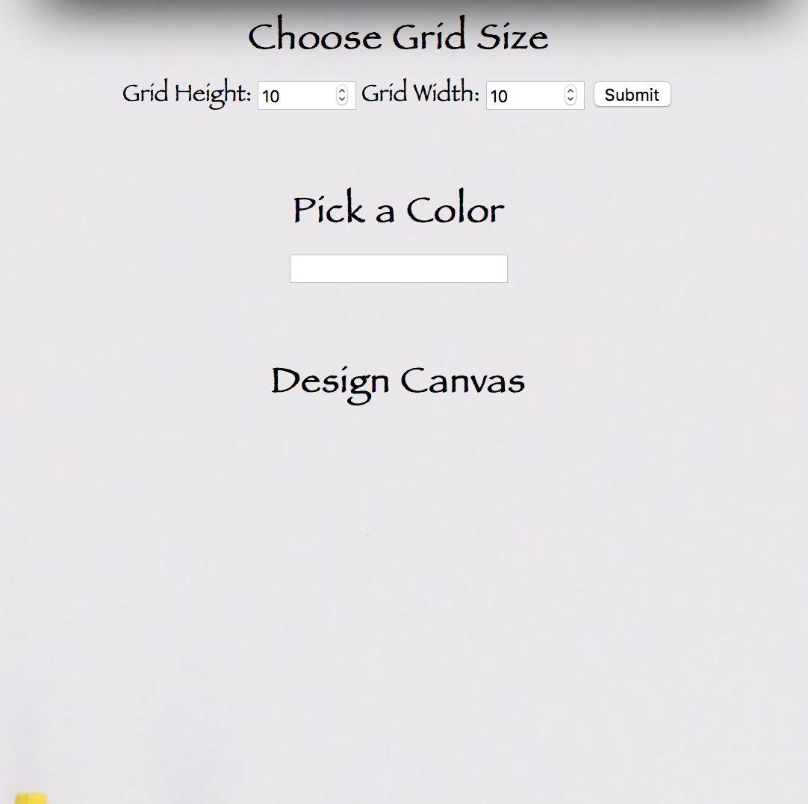

Pixel Art Generator

The project was created for individuals to use their creativity to create fun or useful images using pixels. I wanted to create something visual with an artistic attribute that will draw users attention.

Installing
Step 1: Copy the Repository
Step 2: Git clone the repository onto your command line
Step 3: CD into your repository
Step 4: Open the Pixelart.html file into the browser(Firefox or internet explorer commonly used)
Step 5: You can either open the file from the editor or copy and paste the path of the file into the browser.
Step 6: Browser should be displayed and ready for execution.

Getting Started
1. Once you have the file open on the browser you'll be able to create your pixel art.
2. Using the "Choose Grid Size" application you can adjust the grid to you preferred needs.
3. By selecting the box under "Pick a Color" you'll be able to select any color you prefer from the color chart.
4. After you've selected the size and color, you can select the desired boxes you want to use to create your art.
5. You can go back to the color scheme and change the colors as many times as needed.

